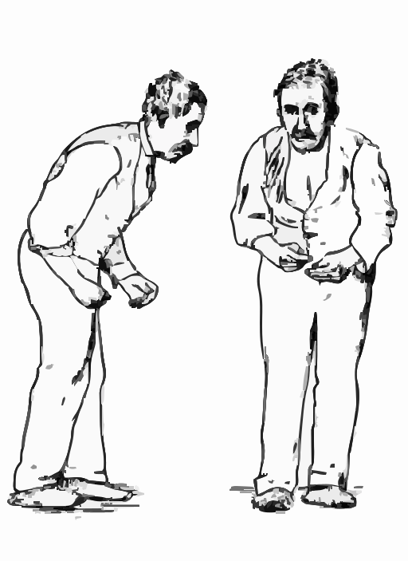

# Parkinson's Detection System



This project is a Parkinson's detection system that uses audio features extracted from voice recordings to predict the likelihood of Parkinson's disease. The system includes a machine learning model and a Streamlit-based frontend for user interaction.

## Features
- **Machine Learning Model**: A neural network trained on audio features to detect Parkinson's disease.
- **Streamlit Frontend**: Upload audio files to check for Parkinson's likelihood.
- **Dark Theme**: A user-friendly interface with a black background and white text.
- **Audio Features**: Extracts multiple audio features, including MFCCs, chroma, spectral contrast, jitter, shimmer, and more.

## Installation
1. Clone the repository:
   ```bash
   git clone <repository-url>
   cd parkinson-ai
   ```
2. Install dependencies:
   ```bash
   pip install -r requirements.txt
   ```

## Usage
1. Run the Streamlit app:
   ```bash
   streamlit run app/streamlit_app.py
   ```
2. Upload an audio file (e.g., `.wav` or `.mp3`) to check for Parkinson's disease.

## Audio Features
The system extracts the following features:
- **MFCCs**: Mel-frequency cepstral coefficients.
- **Chroma**: Chroma energy normalized statistics.
- **Spectral Contrast**: Differences in spectral peaks and valleys.
- **Jitter/Shimmer**: Measures of voice instability.
- **Harmonic-to-Noise Ratio (HNR)**: Ratio of harmonic sound to noise.
- **TQWT Features**: Time-frequency analysis (placeholder).
- **Formants**: Resonant frequencies of the vocal tract (placeholder).

## Testing
A sample audio file is provided in the `data/test_audio/` directory for testing.

## License
This project is licensed under the MIT License.